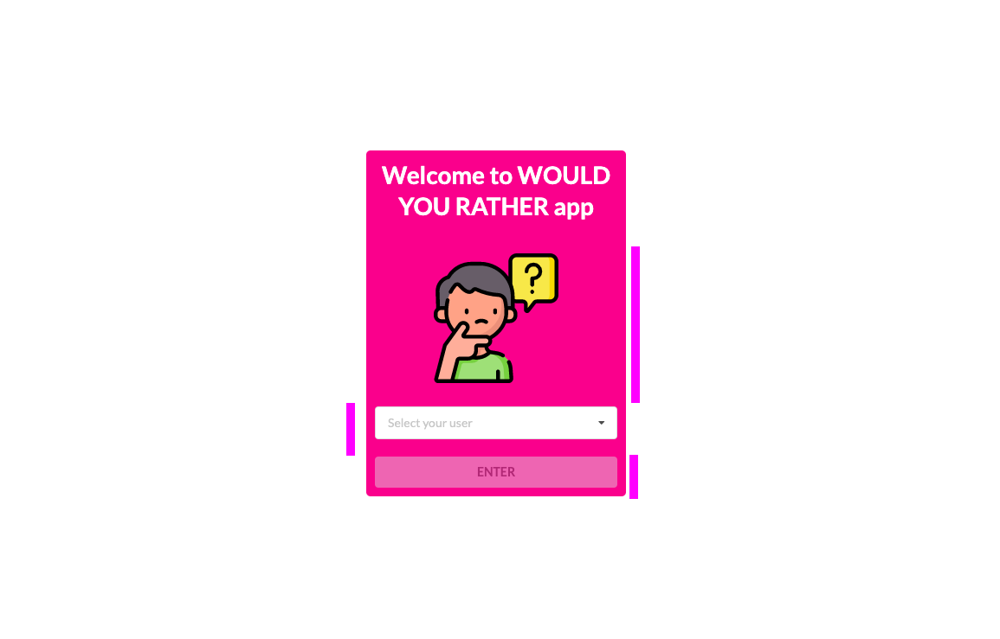

# Would you rather UDACITY project

This is UDACITY React nanodegree capstone project #2. 

## Installation

To get started and test my project

- install project dependencies with `npm install` or `yarn install`
- start the development server with `npm start` or `yarn start`

## The project approach

Here you will find my project and the steps that I have made to build it. I will follow the guidelines provided by udacity team and they are as follows:

1. Draw All the Views of the App
2. Break Each View Into a Hierarchy of Components
3. Determine What Events Happen in the App
4. Determine What Data Lives in the Store.

Let's get started.

## 1.Draw all the views of the app

With the help to the following YouTube video we are able to build the different page views.

[Would you rather app](https://youtu.be/xfmSkLAL__Q)

So you will have a couple of different pages here:

- Home, is it's own component and page ("/home")
- Login, rendered in `Home` component ("/home")
- QuestionPage, is it's onw component and page ("/question/:id")
- LeaderboardPage, is it's own component and page ("/leaderboard")
- NewQuestion, is it's onw component and page ("/add")
- NoMatch, is it's own component and page (anything that is not defined above)

> At the beginning I had divided `QuestionPage` and `QuestionResultPage`, as I thought this was a better implementation, however I needed to follow the rubric 100% so that your project gets approved 

Note that for every different page, I will need to create a different url, with exception of Login and Home page given they will share the same and will be the root of my app.   

I am not sure if I am missing something out, but for now, I reckon this is a very good start and we can always go back to the main project rubric to check if I are missing something out.

Let's dive in the components for each page.

## 2.Components breakdown

### Login page

From a component stand point, this one will be very simple, it will have an (a) Icon with the logo of the app, (b) a dropdown for the user to select his profile and (c) a submit button to login that user.  



The Login page will be inserted in the App.js file. Actually all my components will be inserted here and will be rendering them according to the user interaction with the my application.


### Home page

Existing components 
- NavBar (will be present in every page with the exception of Login)
- QuestionCard (for unanswered and answered questions)


The NavBar will help the user navigate through the App and will get the user access to the `Home`, `New question` and `Leaderboard` page as well as show the avatar for the user and a button to logout the user. 

You will also find the "body" of the page with "toggle" between the questions that user didn't answered and the ones he did. 

The `QuestionCard` will display information of the questions and provide a way to answer and unanswered question or check the result of a question that the user as already answered to. 

### QuestionPage

- NavBar (as mentioned before will also be present here)
- QuestionCard (with the selected unanswered question)

### Answered question page

- NavBar
- QuestionCard (with the question results)

### New question page

- NavBar
- NewQuestionForm

### Leaderboard page

- NavBar
- LeaderboardCard

I think we are all good for now... let's start to figure out what are the main actions on our app.

## 3.Determine What Events Happen in the App

When you open the app you, before you login, you should get users and the questions:

- get **users**,
- get **questions**

During the login phase you need to set the authUser

- set **authUser**

When you are in the unanswered questions pane, you need to get the unanswered questions, whereas in the answered questions pane the ones that the user answered already.

- get **questions** (the correct ones :)
- get **authUser**

### 4.Determine What Data Lives in the Store

To be very honest, here I followed the current structure of the data. I reckon I would struggle to do this were I to start an application from scratch. 

For me my store looked like this: 

```js 
import { combineReducers } from "redux";
import { loadingBarReducer } from "react-redux-loading-bar";

import questions from "./questions";
import users from "./users";
import authUser from "./authUser";

export default combineReducers({
  authUser,
  questions,
  users,
  loadingBar: loadingBarReducer
});

```

The loadingBar is keeping tabs with the needed information for me to render the loadingBar properly. 


